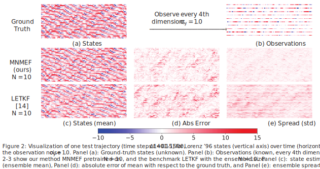

# Learning Enhanced Ensemble Filters

This is the code repository for our paper ["Learning Enhanced Ensemble Filters"](https://arxiv.org/abs/2504.17836). It contains the complete implementation of our proposed method, Measure Neural Mapping enhanced Ensemble Filter (MNMEF), along with related test code and code for benchmark methods.

## Installation and Setup

Follow these steps to set up the project environment:

1.  **Prerequisites:**
    * Ensure you have Python 3.12 installed on your system.

2.  **Create a virtual environment:**
    Open your terminal or command prompt, navigate to the project's root directory, and run the following command to create a virtual environment named `.venv`:
    ```bash
    python3.12 -m venv .venv
    ```
    If `python3` or `python` is already aliased to your Python 3.12 installation, you might be able to use:
    ```bash
    python -m venv .venv
    ```

3.  **Activate the virtual environment:**

    * **On macOS and Linux:**
        ```bash
        source .venv/bin/activate
        ```
    * **On Windows (Command Prompt):**
        ```bash
        .\.venv\Scripts\activate
        ```
    * **On Windows (PowerShell):**
        ```bash
        .venv\Scripts\Activate.ps1
        ```
    You should see the name of the virtual environment (`.venv`) appear at the beginning of your command prompt, indicating it's active.

4.  **Install dependencies:**
    Once the virtual environment is activated, install the required packages using the `requirements.txt` file:
    ```bash
    pip install -r requirements.txt
    ```


## Important Notes

* **Dataset Information:** The current codebase supports three datasets: the Kuramoto-Sivashinsky (KS) equation, the Lorenz '96 model, and the Lorenz '63 model. Please be aware that the first time you run the code, it may take a significant amount of time as it needs to construct the datasets. Subsequently, these datasets will be saved in the `data/` directory for faster access.

* **Pre-trained Models:** We provide our pre-trained models, as well as models that have been fine-tuned for different ensemble sizes. You can download these models from our <font color="red">[Google Drive]</font>. After downloading, place the model files into the `save/` directory to use them.

* **Configuration Details:** You can find detailed settings for our training parameters in the `config/cli.py` file. We use different default parameters for each dataset. These dataset-specific default configurations are referenced in `config/dataset_info.py`.

## Usage

**To train a new model from scratch**, use the `train.py` script. For example, to train a model on the Kuramoto-Sivashinsky (KS) system with an ensemble size `N=10` and an observation noise standard deviation `sigma_y=1.0`, execute the following command:

```bash
python train.py --dataset ks --N 10 --sigma_y 1
```
You can also find more examples and scripts for batch training in `scripts/run_train.sh`.


## Lorenz '96 Model Results from Our Paper

Here are the three main figures from our paper concerning the Lorenz '96 model experiments. These figures include their original captions.




