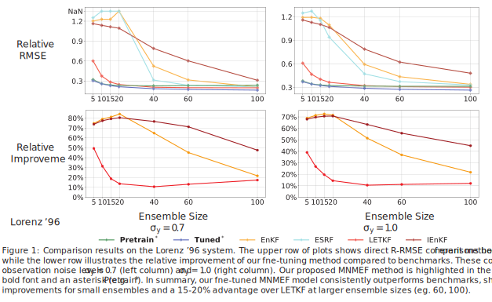

# Learning Enhanced Ensemble Filters

This is the code repository for our paper ["Learning Enhanced Ensemble Filters"](https://arxiv.org/abs/2504.17836). It contains the complete implementation of our proposed method, Measure Neural Mapping enhanced Ensemble Filter (MNMEF), along with related test code and code for benchmark methods.

## Installation and Setup

Follow these steps to set up the project environment:

1.  **Prerequisites:**
    * Ensure you have Python 3.12 installed on your system.

2.  **Create a virtual environment:**
    Open your terminal or command prompt, navigate to the project's root directory, and run the following command to create a virtual environment named `.venv`:
    ```bash
    python3.12 -m venv .venv
    ```
    If `python3` or `python` is already aliased to your Python 3.12 installation, you might be able to use:
    ```bash
    python -m venv .venv
    ```

3.  **Activate the virtual environment:**

    * **On macOS and Linux:**
        ```bash
        source .venv/bin/activate
        ```
    * **On Windows (Command Prompt):**
        ```bash
        .\.venv\Scripts\activate
        ```
    * **On Windows (PowerShell):**
        ```bash
        .venv\Scripts\Activate.ps1
        ```
    You should see the name of the virtual environment (`.venv`) appear at the beginning of your command prompt, indicating it's active.

4.  **Install dependencies:**
    Once the virtual environment is activated, install the required packages using the `requirements.txt` file:
    ```bash
    pip install -r requirements.txt
    ```


## Important Notes

* **Dataset Information:** The current codebase supports three datasets: the Kuramoto-Sivashinsky (KS) equation, the Lorenz '96 model, and the Lorenz '63 model. Please be aware that the first time you run the code, it may take a significant amount of time as it needs to construct the datasets. Subsequently, these datasets will be saved in the `data/` directory for faster access.

* **Pre-trained Models:** We provide our pre-trained models, as well as models that have been fine-tuned for different ensemble sizes. You can download these models from our [Google Drive](https://drive.google.com/drive/folders/1vwJEpIQI8qr1wTOmrHCEXYrySab9Wbky?usp=sharing). After downloading, place the model files into the `save/` directory to use them.

* **Configuration Details:** You can find detailed settings for our training parameters in the `config/cli.py` file. We use different default parameters for each dataset. These dataset-specific default configurations are referenced in `config/dataset_info.py`.

## Usage

**To train a new model from scratch**, use `train.py`. For example, to train a model on the KS system with an ensemble size `N=10` and an observation noise standard deviation `sigma_y=1.0`, execute the following command:

```bash
python train.py --dataset ks --N 10 --sigma_y 1
```
You can also find more examples and scripts for batch training in `scripts/run_train.sh`.

**To fine-tune a pre-trained model**, use `finetune.py`. For example, to fine-tune a model for the KS system for `20` epochs, using an observation noise standard deviation `sigma_y=1.0`, a learning rate of `5e-5`, and loading a specific checkpoint, run:
```bash
python finetune.py --epochs 20 --save_epoch 20 --dataset ks \
--sigma_y 1 --learning_rate 5e-5 --cp_load_path path_to_checkpoint
```
Note: You will need to replace `path_to_checkpoint` with the actual path to your pre-trained model checkpoint file. The ensemble sizes for fine-tuning are defined within the `finetune.py` script. For further examples of fine-tuning, please refer to the script `scripts/run_fine_tuning.sh`.

**To evaluate a trained model**, use `evaluate.py`. For example, to evaluate a model for the KS system with an ensemble size `N=10`, an observation noise standard deviation `sigma_y=1.0`, and loading a specific checkpoint, run:
```bash
python evaluate.py --dataset ks --N 10 --sigma_y 1 \
--cp_load_path path_to_checkpoint
```
Note: You must replace `path_to_checkpoint` with the actual path to your saved model checkpoint file to run `evaluate.py`. For further examples of model evaluation, please refer to the scripts `scripts/run_test.sh` and `scripts/run_ft_test.sh`.

**To obtain results for various benchmark data assimilation methods**, you can use the `evaluate_benchmark.py` script. This script typically relies on pre-computed optimal hyperparameters for the benchmark methods.

For example, to evaluate the LETKF benchmark method for the KS system, assuming an ensemble size `N=10` and an observation noise standard deviation `sigma_y=1.0` (for which optimal hyperparameters should be available), you can run the following command (e.g., on a CPU):

```bash
python evaluate_benchmark.py --dataset ks --N 10 --sigma_y 1 --v LETKF --device cpu
```
Notes: 

1. To run benchmark evaluations using `evaluate_benchmark.py`, you first need a `benchmark` directory located inside your `save/` folder (e.g., `save/benchmark/`). This directory must contain CSV files (like `benchmarks_ks.csv` for the KS system) that list the optimal hyperparameters for the various benchmark methods, specific to conditions such as ensemble size and noise level. These hyperparameter CSVs are generated using [DapperGridSearch](https://github.com/wispcarey/DapperGridSearch), which itself is based on the [DAPPER (Data Assimilation with Python: a Package for Experimental Research)](http://dappergithub.com/nansencenter/DAPPER) package.

2. For more examples and detailed usage for evaluating benchmark methods, please refer to the script: `scripts/run_benchmark_test.sh`.

## Lorenz '96 Model Results from Our Paper

Here are the three main figures from our paper concerning the Lorenz '96 model experiments. These figures include their original captions.




